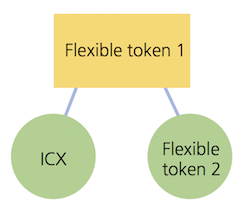
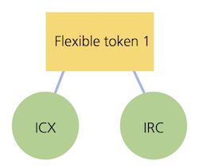
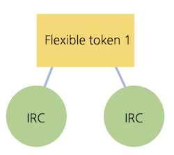
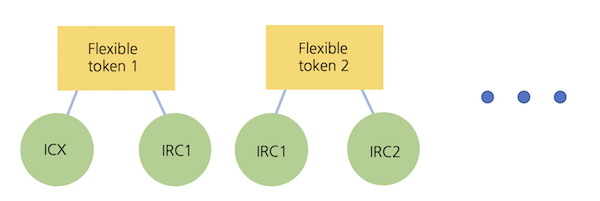

# ICON DEX

ICON DEX is a decentralized liquidity exchange network on Loopchain that allows users to buy and sell tokens without matching buyers and sellers in an exchange. 

Through the use of multiple SCOREs in the network, Flexible Tokens can be created that hold one or more other tokens as connectors. By using a connector token model and algorithmically-calculated conversion rates, tokens are calculated their own prices and converted seamlessly. 

The main ones are the Flexible Token and Converter. The Converter is responsible for converting between a token and its connectors. Flexible Token represents a converter aware *IRC-2* compliant token.

This project refers to the Bancor Protocol™  [Whitepaper](https://www.bancor.network/whitepaper) for more information.

## Component 

### Flexible token

Flexible Tokens operate as regular tokens, in compliance with *IRC-2* token standard used on Loopchain, but include additional logic that allows users to always buy and sell them directly through their own SCOREs at prices that programmatically adjust to reflect supply and demand. For this, the main function of Flexible token is to increase or decrease the token supply. Then sends the new tokens to an account or removes tokens from an account to destroy them.  

#### issue

```python
@external
def issue(self, _to: Address, _amount: int) -> None:
```

Increases the token supply and sends the new tokens to an account can only be called by the contract owner.

##### Parameters

- _to : account to receive the new amount
- _amount : amount to increase the supply by

#### destroy

```python
@external
def destroy(self, _from: Address, _amount: int) -> None:
```

Removes tokens from an account and decreases the token supply can be called by the contract owner to destroy tokens from any account or by any holder to destroy tokens from his/her own account.

##### Parameters

- _from: account to remove the amount from
- _amount: amount to decrease the supply by

### Converter

Converter allows conversion between a flexible token and other *IRC-2* tokens and between different *IRC-2* tokens and themselves. 

Converter has properties to use on converting such as connector tokens and their information, conversion fee and total connector weight. And by using connectors information, it excutes token conversion. Conversion includes buying the token by depositing one of its connector tokens and selling the token by withdrawing from one of its connector tokens.  

When the Token Converter receives tokens, tokenFallback external method is called and if the data parameter is parsed as conversion format, token conversion is executed. Conversion format is as below. 

```json
{
    'toToken': [STR_ADDRESS],
    'minReturn': [INT]
}
```

*IRC-2* connector balance can be virtual, meaning that the calculations are based on the virtual balance instead of relying on the actual connector balance. This is a security mechanism that prevents the need to keep a very large (and valuable) balance in a single contract.

### Network  

The network is the main entry point for token conversions to convert between any token (*ICX*, *IRC-2* and Flexible token) in the network to any other token in a single transaction by providing a conversion path.

The conversion path is a data structure represented by a single array. It is used when converting a token to another token in the network when the conversion cannot necessarily be done by a single converter and might require multiple 'hops'. The path defines which converters should be used and which conversion should be done in each step.

##### Conversion path format :

[source token, flexible token, to token, flexible token, to token...]

Max Length of Conversion path should be **21** as using different 10 conversions.

For example, the simplest path should be [source token, flexible token, to token]. The first element's of conversion path list is always the source token which is ICX token, *IRC-2* or Flexible token. And each 'hop' is represented by a 2-tuple flexible token and to token. 
The Flexible token in the 2-tuple ones is only used as a pointer to a converter rather than converter (since converter addresses are more likely to change).

## Main external methods

#### getExpectedReturnByPath

```python
@external(readonly=True)
def getExpectedReturnByPath(self, _path: str, _amount: int) -> int:
```

Returns the expected return amount for converting a specific amount by following a given conversion path. Notice that there is no support for circular paths.

##### Parameters

-  _path: conversion path, see conversion path format above
- _amount: amount to convert from (in the initial source token)

##### Return

expected conversion return amount and conversion fee

#### convert 

```python
@external
@payable
def convert(self, _path: str, _minReturn: int) -> int:
```

It converts the Icx token to any other token in the network by following a predefined conversion path and transfers the result tokens back to the sender. This method is used on converting from ICX token to IRC token.

Notes that the converter should already own the source tokens.

##### Params

- _path: conversion path as string which is comma-delimited lists , see conversion path format as below.

  Conversion path - 

  [source token, flexible token, to token, flexible token, to token...]

  **If the source token address of the path is not the icx token, raise error**.

- _minReturn: if the conversion results in an amount smaller than the minimum return - it is canceled, must be nonzero.

##### Return

tokens issued in return 

#### transfer

```python
@external
def transfer(self, _to: Address, _value: int, _data: bytes = None) -> None:
```

An account attempt to get the token. 

It is one of *IRC-2* compliant methods to be used on converting from IRC2 compliant token to token. 

##### Params

- _to  :  Network address
- _value :  transfer amount 
- _data : data as bytes having keys of 'path' and 'minReturn'.  The original data form is as below. 

  ```json
  {
      "path": "cx863333129b4077652c352ae765d9c4084e35d3d1,cx8e91e81f3db177b7b591f20dac83b2204a7cbee0,cx8e91e81f3db177b7b591f20dac83b2204a7cbee0", 
      "minReturn": 1
  }
  ```
  - path :  conversion path as string which is comma-delimited lists.
  - minReturn: if the conversion results in an amount smaller than the minimum return - it is canceled, must be nonzero.

##### Return

None

## How to deploy ICON Dex 

0. By using a builder in this project, makes target SCOREs and their dependencies write on you need to deploy. 

    ```shell
    # Whites all of SCOREs in ICON DEX and their dependencies to the file system under the builder directory. 
    $ python build.py 
    # Whites SCOREs and their dependencies you write down to the file system under the builder directory. 
    $ python build.py <whitespace-delimited lists of SCOREs>
    # Cleans all files under the builder directory. 
    $ python build.py clean
    ```

1. Deploy Registry SCORE at first. 

2. Deploy Network SCORE and register it to the Registry SCORE by sending a transaction to call an external method of `registerAddress` on the Registry SCORE. You can check it by querying an external method of `getAddress` on the Registry SCORE. 

    ##### registerAddress
    
    ```python
    @external
    def registerAddress(self, _scoreName: str, _scoreAddress: Address) -> None:
    ```
    
    Register an address to Registry SCORE. 
    
    ###### Params 
    - _scoreName : SCORE name to be registered 
    - _scoreAddress : SCORE address to be registered. In the case, puts in the deployed Network SCORE address. 
    
    ##### getAddress 
    
    ```python
    @external(readonly=True)
    def getAddress(self, _scoreName: str) -> Address:
    ```
    
    Gets an address from the SCORE name. The SCORE have already registered. If not it return ZERO SCORE ADDRESS. 
    
    ###### Params 
    - _scoreName : the registered SCORE name 

3. Deploy ICX token SCORE, register it to the Network SCORE by sending a transaction to call an external method of `registerIcxToken` on the Network SCORE. And send ICX to the ICX token SCORE. 

    ##### registerIcxToken
    
    ```python
    @external
    @external
    def registerIcxToken(self, _icxToken: Address, _register: bool) -> None:
    ```
    
    Allows the owner to register/unregister Icx tokens.
    
    ###### Params 
    - _icxToken: Icx token contract address
    - _register: true to register, false to unregister
    
    ##### getIcxTokenRegistered
    
    ```python
    @external(readonly=True)
    def getIcxTokenRegistered(self, _icxToken: Address) -> bool:
    ```
    
    returns the information about icx token registration of a given token address
    
    ###### Params 
    - icxToken: icx token address that you want to check
    
    ###### Returns
    - registration information. if returns true, that shows token is registered as an icx token in the network

4. Deploy the Flexible token SCORE with four parameter which is _name, _symbol, _initialSupply, and _decimals for initializing.  

    ##### on_install method of Flexible token SCORE
    
    ```python
    def on_install(self, _name: str, _symbol: str, _initialSupply: int, _decimals: int) -> None:
    ```
    
    ###### Example
    First, deploy the Flexible token named  `flexible_token_1` and symboled `FT1`.
    Params of deploying transaction are as below. 
    
    ```json
    {
        "_name": "flexible_token_1",
        "_symbol": "FT1",
        "_initialSupply": 2000,
        "_decimals": 18
    }
    ```
    
    Second, deploy the other Flexible token named `flexible_token_2` and symboled `FT2`. Params of deploying transaction are as below. 
    
    ```json
    {
        "_name": "flexible_token_2",
        "_symbol": "FT2",
        "_initialSupply": 1000,
        "_decimals": 18
    }
    ```

5. Deploy Converter for flexible_token_1 and add a connector of ICX token. 

    

    ##### on_install method of Converter SCORE
    
    ```python
    def on_install(self,
                  _token: Address,
                  _registry: Address,
                  _maxConversionFee: int,
                  _connectorToken: Address,
                  _connectorWeight: int):
    ```
    
    ###### params
    - _token: flexible token governed by the converter
    - _registry: address of a contract registry contract
    -  _maxConversionFee: maximum conversion fee, represented in ppm
    - _connectorToken: optional, initial connector, allows defining the first connector at deployment time
    - _connectorWeight: optional, weight for the initial connector
    
    ###### Example
    Params of deploying transaction is as below. 
    
    ```json
    {
        "_token": str(self.flexible_token_1_address), 
        "_registry": str(self.score_registry_address),
        "_maxConversionFee": 0,
        "_connectorToken": str(self.icx_token_address), 
        "_connectorWeight": 500000
    }
    ```

6. Add connector of flexible_token_2 by sending a transaction to call an external method of `addConnector` on Converter SCORE.

    ##### addConnector
    
    ```python
    @external
    def addConnector(self, 
                 _token: Address, 
                 _weight: int, 
                 _enableVirtualBalance: bool) -> None:
    ```
    
    Defines a new connector for the token. It can only be called by the owner while the converter is inactive.
    
    ###### Params
    - _token: address of the connector token
    - _weight: constant connector weight, represented in ppm, 1-1000000
    - _enableVirtualBalance: true to enable virtual balance for the connector,
     ​    false to disable it
    
    ###### Examples 
    Params of sending a call transaction is as below. 
    
    ```json
    {
       "_token": str(self.flexible_token_2_address),
       "_weight": 500000,
       "_enableVirtualBalance": 0
    }
    ```
    

## How to convert token to the other token 

### Converting ICX token to IRC token 



By calling the [`convert`](#convert) external method, it allows ICX to be converted into IRC. 

### Converting IRC token to IRC token



By calling the [`transfer`](#transfer) external method, it allows IRC token to be converted into the other IRC token. 

### Getting expected amount of the token 

By querying the `getExpectedReturnByPath` which is read-only external method, it allows to get expected amount of the token. 

#### getExpectedReturnByPath

```python
@external(readonly=True)
def getExpectedReturnByPath(self, _path: str, _amount: int) -> int:
```

Returns the expected return amount for converting a specific amount by following
a given conversion path.
Notice that there is no support for circular paths

##### Params

- _path: conversion path, see conversion path format above
- _amount: amount to convert from (in the initial source token) 

##### Return

expected conversion return amount and conversion fee

### Converting token to the other token with multiple converters



#### Component

- converter : flexible token 1, flexible token 2 ..
- connector token : ICX, IRC1, IRC2 .. 

#### case 1 : Converting ICX to IRC2 with multiple converters

In the case, it excutes conversion same as converting ICX token to IRC token with one converter by calling the `convert` external method.

The difference is conversion path, see conversion path format above.

#### case 2 : Converting IRC to ICX with muliple converters

In the case, it excutes conversion same as converting IRC token to IRC token with one converter by calling the `transfer` external method.

The difference is conversion path, see conversion path format above.

## License 

This project follows the Apache 2.0 License. Please refer to [LICENSE](https://www.apache.org/licenses/LICENSE-2.0) for details.